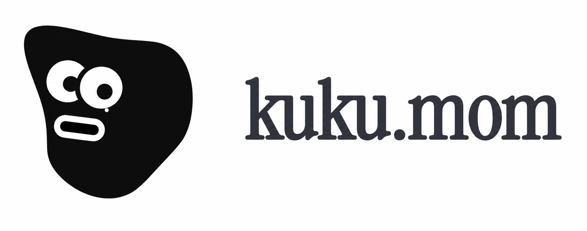

  <h1 align="center">
    
    Momo
  </h1>

  

    <strong>A local-first Markdown knowledge workspace for macOS.</strong> 
    Plain files, personal wiki, Second Brain workflows, AI diffs, and encrypted sync.
  

  

    &nbsp;
    &nbsp;
    
  

  

    
  

  

    <a href="apps/web"><strong>Website</strong></a> ·
    <a href="docs/development.md"><strong>Development</strong></a> ·
    <a href="docs"><strong>Docs</strong></a> ·
    <a href="docs/development.md"><strong>Development</strong></a> ·
    <a href="README_ko.md"><strong>한국어</strong></a>
  

  

    
  

  ⭐ <em>If Momo feels useful or interesting, a GitHub star helps the project reach more people.</em>

## What Is Momo?

Momo is an open-source Markdown app for people who want their notes to stay portable, private, and useful to AI. It edits ordinary `.md` files in a local vault, then layers search, graph navigation, AI assistance, Second Brain workflows, and encrypted sync on top.

The project is not just a desktop app. This repository includes the macOS client, web app, Go server, protobuf contracts, Rust AI/indexing crates, and Docker infrastructure needed to inspect or self-host the system.

## Why It Exists

- **Your files should stay yours**: notes remain plain Markdown, not hidden platform data.
- **AI should be reviewable**: AI can read, search, and propose changes, but edits flow through approval and diffs.
- **Knowledge should improve explicitly**: decision documents turn AI proposals into traceable memory and wiki updates.
- **Infrastructure should be inspectable**: server, sync, contracts, and deployment code live in the open.
- **Cloud should be optional**: use Momo locally, sign in for managed convenience, or self-host the stack yourself.

## Highlights

- **Local Markdown vault**: open a folder and keep writing in files that work with git, vim, Obsidian, and other Markdown tools.
- **Personal wiki**: connect notes with `[[wikilinks]]`, backlinks, search, and 2D / 3D graph navigation.
- **Second Brain workflows**: manage memory, wiki pages, proposals, and decisions as Markdown inside your vault.
- **Self-improving AI context**: accept, reject, or revise decision documents so future AI conversations inherit better context.
- **AI-native editing**: use Agent / Ask / Inline modes, attach files or selected text, and review proposed edits before applying.
- **Encrypted sync foundation**: sync workspaces, devices, key envelopes, signed commits, and encrypted objects without exposing plaintext notes to the server.

## Install

The official build is currently available for macOS.

- **Recommended**: build locally for now, or wire the release links after the Momo distribution repo is ready.

Platform status:

- macOS: supported
- Windows: coming soon
- Linux: coming soon

## Open Source

Momo is built as a full-stack open-source project, not a thin client around a closed service. If you want to explore how it works, start with:

- [Development and self-hosting notes](docs/development.md)
- [Planning docs](docs)

## Contributing

Bug reports, feature ideas, documentation improvements, and pull requests are welcome. For larger changes, please open an issue first so we can align on direction.

Momo's core principle is simple: your files belong to you, and the tool should not take that control away.

## License

[MIT](LICENSE) © Momo
