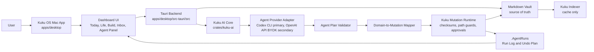
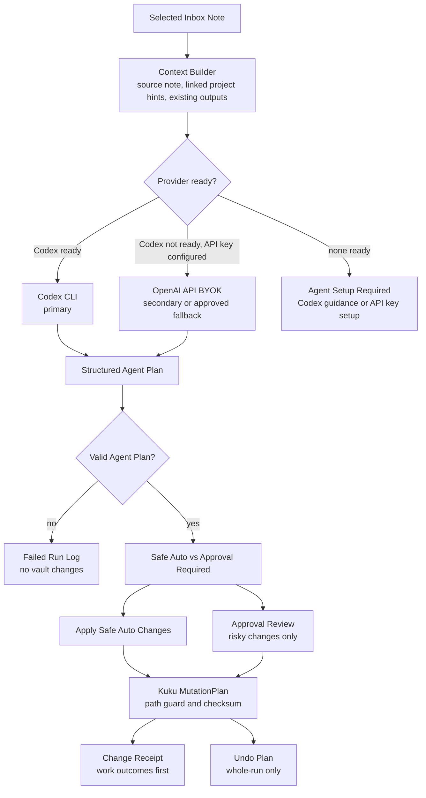
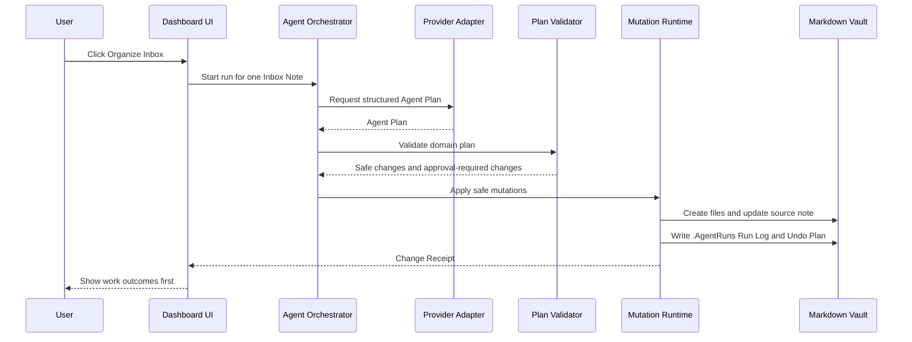

# Kuku OS MVP Architecture

Date: 2026-06-27
Status: Planning artifact for Kuku fork MVP

## Inputs

- Existing product direction: `../superpowers/specs/2026-06-27-kuku-fork-dashboard-design.md`
- Domain language: `../CONTEXT.md`
- Generated mockups:
  - `../assets/kuku-os/kuku-os-today-dashboard.png`
  - `../assets/kuku-os/kuku-os-codex-setup.png`
  - `../assets/kuku-os/kuku-os-organize-inbox-flow.png`
- Upstream Kuku structure checked on 2026-06-27:
  - `apps/desktop`
  - `apps/desktop/src`
  - `apps/desktop/src-tauri/src`
  - `crates/kuku-ai`
  - `crates/kuku-contract`
  - `crates/kuku-indexer`
  - `packages/contract`
- Lazyweb UI reference pass: desktop productivity dashboards and desktop onboarding/setup screens. Useful patterns came from Taskade, Wrike, Miyagi Labs/Lake, Asim, Delinea/Appcues/Rise style setup flows.

## Product Shape

Kuku OS is a Kuku fork, not a separate replacement app. The MVP keeps Kuku's existing Markdown vault, editor, wikilinks, backlinks, graph, search, and AI chat foundations. The new surface is a Mac-only operating dashboard that makes the first screen useful for non-developers.

The center of the app becomes Today Dashboard. The left side keeps the Kuku vault visible. The right side keeps AI or inspector behavior visible, but changes the first useful agent action to Organize Inbox.


## High-Level Architecture



## Preserve Kuku, Add Operating Layer

Kuku OS should add an operating layer over the existing vault:

| Layer | Responsibility | MVP guidance |
| --- | --- | --- |
| Existing Kuku surfaces | Markdown editing, notes, graph, search, backlinks, existing AI chat | Preserve behavior and navigation. |
| Operating domain layer | Projects, Managed Tasks, Issues, Schedule Blocks, Planning Candidates | Store as Markdown frontmatter in the vault. |
| Dashboard layer | Today, Life lane, Build lane, quick Inbox capture, Weekly Planning | Build as a first-class desktop UI surface. |
| Agent orchestration layer | Organize Inbox, provider selection, plan validation, safe/approval split, receipts, undo | One Inbox Note per run in MVP. |
| Cache/index layer | Searchable and filterable views over Markdown | Cache only. Vault remains source of truth. |

## Vault Model

Starter Workspace creates these folders:

```text
/Inbox
/Daily
/Tasks
/Projects
/Issues
/Calendar
/Knowledge
/.AgentRuns
```

The data model stays Markdown-first:

- Project: `type: project`, `project_type: life | build`
- Managed Task: `type: task`, `status: todo | done`, optional `important: true`
- Issue: `type: issue`, `status: backlog | todo | doing | done`, `priority: low | medium | high`, optional `blocked: true`
- Schedule Block: local fixed time range
- Planning Candidate: unscheduled work suggestion
- Inbox Note: original source of messy thought
- Processed Inbox Note: original body preserved, metadata and `Organized into` links added
- Run Log: minimal Markdown receipt under `.AgentRuns`

Indexes can power fast dashboard filtering, but they must be rebuildable from Markdown.

## Agent Architecture



The provider must return a structured Agent Plan. The app must not parse natural-language text to decide what files to write.

### Provider Selection

1. Use Codex CLI when installed and apparently authenticated.
2. Use OpenAI API BYOK when Codex is not ready and the user has configured a key.
3. Show Agent Setup Required when neither provider is ready.

Fallback is a retry after Codex fails, not silent provider switching. OpenAI fallback requires explicit user approval every time because it may incur API cost.


## Safe Auto Policy

Safe Auto applies only after the user explicitly starts an Agent Run. It is not background automation.

Safe Auto Changes:

- create clearly implied Life Projects or Build Projects
- create Managed Tasks
- create Issues
- create Planning Candidates
- create local Schedule Blocks
- create Run Logs
- add Today items
- add source links
- mark an Inbox Note as processed
- add a short `Organized into` link section
- add small tags or backlinks
- create daily or weekly review drafts
- write the Undo Plan

Approval-Required Changes:

- deleting files
- renaming or moving files
- replacing large note bodies
- changing existing Task, Issue, or Project body, title, status, due date, priority, or assignment
- bulk project status changes
- meaningful edits to existing note content
- external service sync
- destructive calendar changes

## Organize Inbox Runtime




## UI Information Architecture

Main app shell:

- Left: Kuku vault navigation, Today, Inbox, Tasks, Projects, Issues, Daily, Knowledge, Search, Graph, AI Chat
- Center: Today Dashboard by default, with Life lane left and Build lane right
- Right: Agent panel, Change Receipt, approval states, inspector details

Project pages:

- Life Project: Timeline plus Next Actions
- Build Project: Issue List first, board later
- Notes: existing Kuku editor remains the long-form surface

Weekly Planning:

- small MVP surface for this week's Life work, Build work, active issues, blocked items, and rescheduling

## Security and Privacy Constraints

- OpenAI API key is stored only in macOS Keychain.
- API keys, Codex auth tokens, full prompts, full model responses, reasoning traces, token logs, raw stdout/stderr, vault paths, and note content must not be stored in Run Logs.
- Codex Readiness Check is shallow: executable availability and non-mutating auth/status check only.
- Diagnostics are user-triggered and minimal.
- Invalid Agent Plan means no partial apply.
- Undo uses checksum-oriented safety and does not overwrite later user edits.

## Implementation Boundary

The MVP should be built mostly inside the desktop fork:

- UI in `apps/desktop/src`
- Tauri commands and local OS integration in `apps/desktop/src-tauri/src`
- Existing AI behavior extended through `crates/kuku-ai`
- Contracts updated through `packages/contract` only if frontend/backend command shapes need generated types
- Indexing behavior extended through `crates/kuku-indexer` only if dashboard query speed needs it

Do not introduce a public SaaS backend for MVP. Do not add Linear, Notion, Google Calendar, Apple Calendar, Slack, Gmail, team collaboration, cycles, or mobile companion in the first release.
