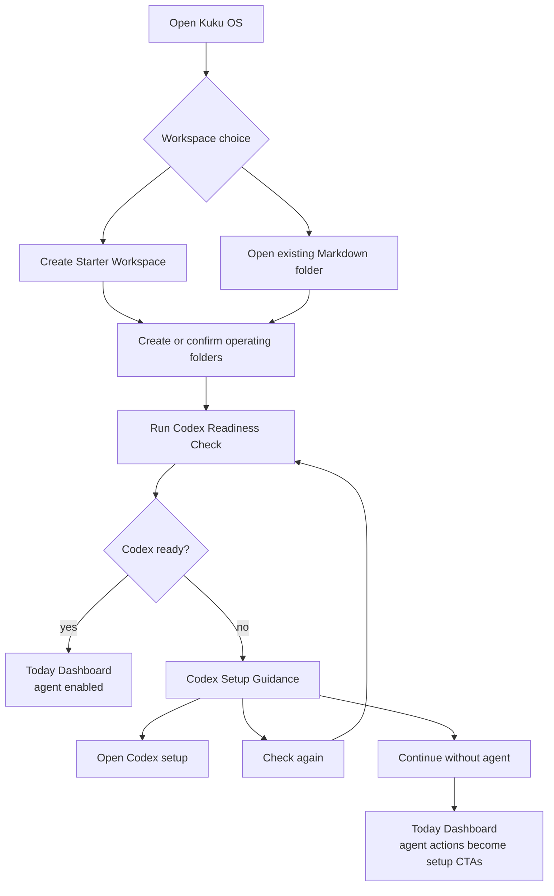
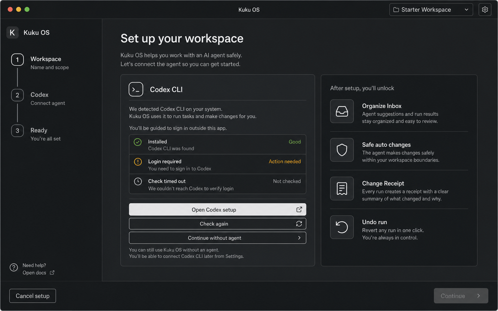
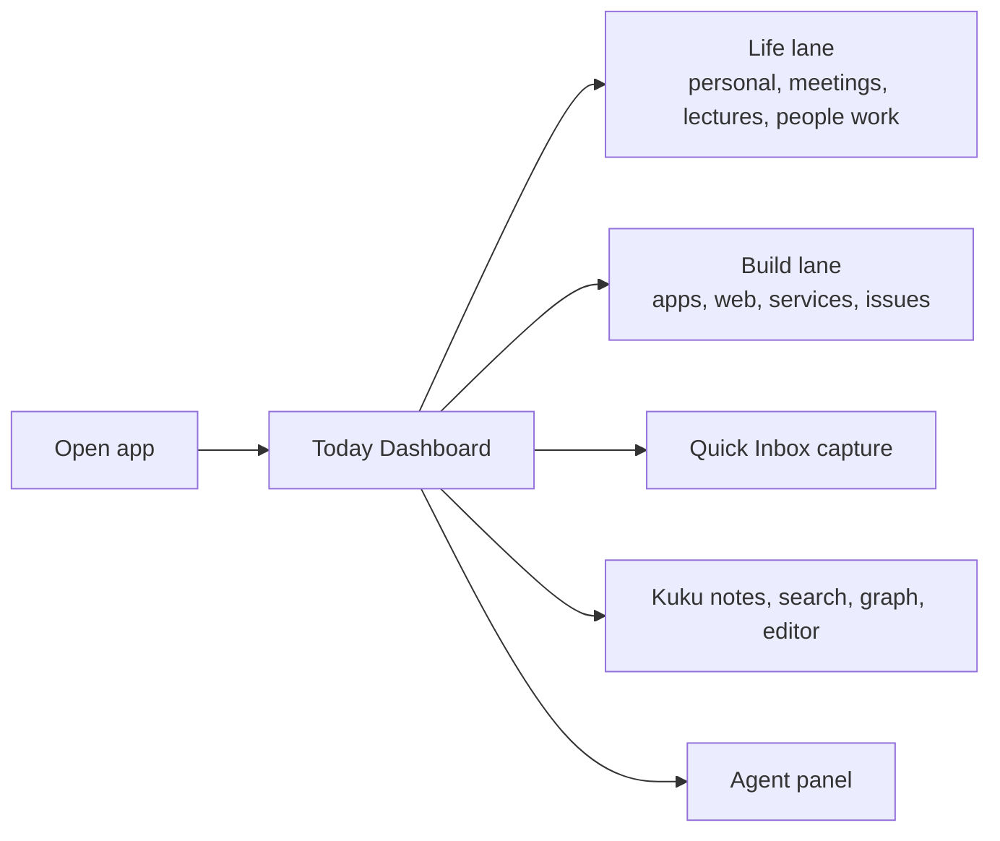
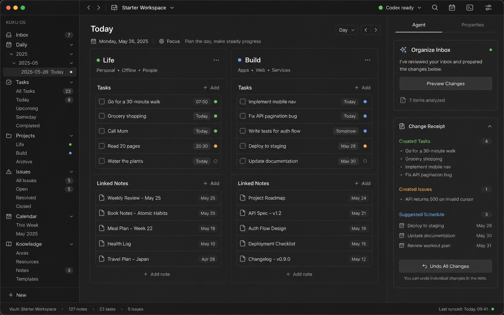
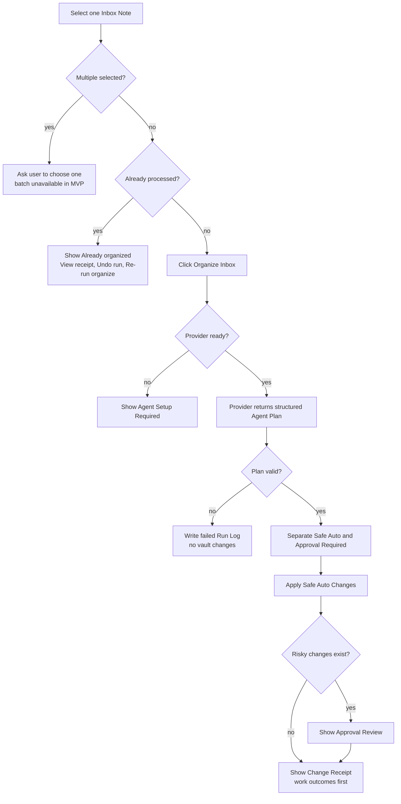
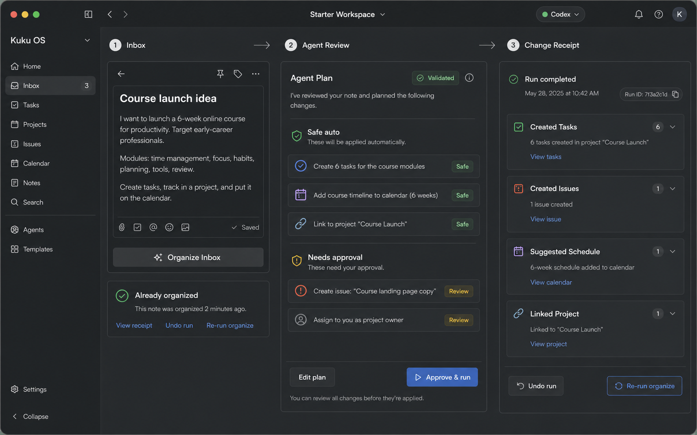
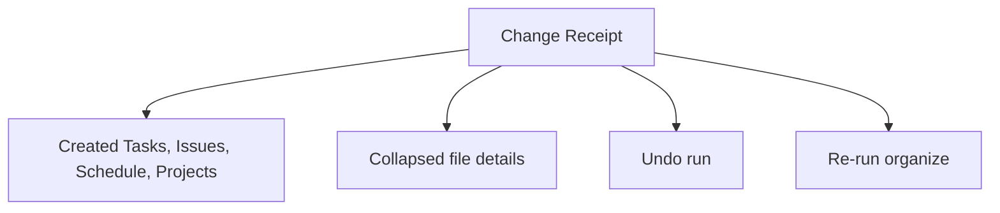
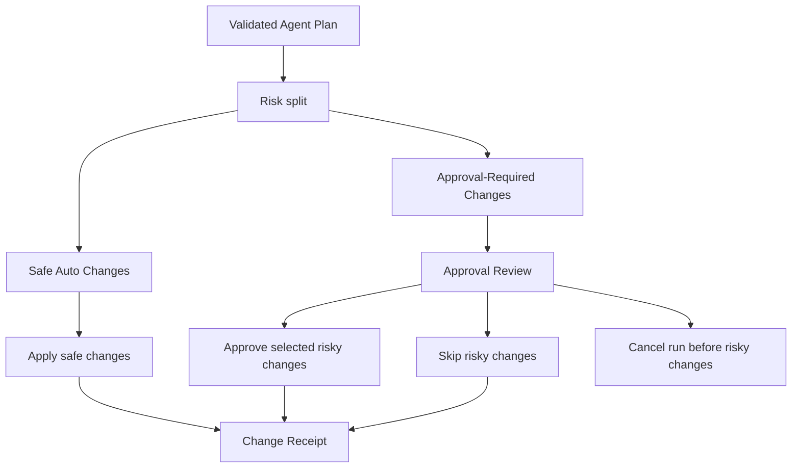
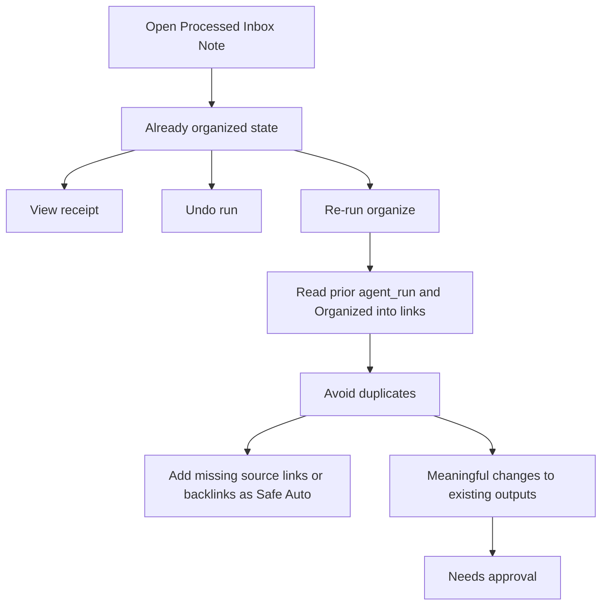
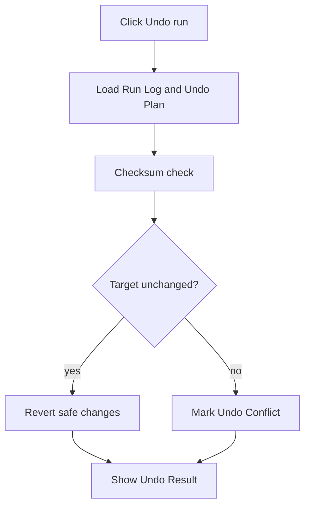

# Kuku OS MVP User Flows

Date: 2026-06-27
Status: Planning artifact for Kuku fork MVP

## Flow Principles

- First screen should answer: "What do I need to do today?"
- Life work and Build work are separated visually, but share the same Markdown vault.
- Ideas start as Inbox Notes. The user should not classify them before writing.
- Agent work starts only when the user explicitly clicks an action.
- Safe changes may apply automatically after the click. Risky changes pause for approval.
- Every Agent Run ends with a Change Receipt and can be undone as a whole run.

## First-Run IA



Primary CTA in setup is `Open Codex setup`. Secondary actions are `Check again` and `Continue without agent`. Continuing without an agent must not block notes, search, graph, manual tasks, manual issues, or dashboard reading.



## Everyday Dashboard Flow



The Today Dashboard is not a marketing page and not a blank note. It is a working surface with clear lanes:

- Life lane: Tasks, Follow-ups, Schedule Blocks, related notes
- Build lane: Issues, Build Projects, due dates, blocked status, related notes
- Quick capture: writes to Inbox as a preserved source note
- Agent panel: offers Organize Inbox when one Inbox Note is selected



## Organize Inbox Flow



MVP rule: one Organize Inbox run processes exactly one Inbox Note. It creates one Run Log, one Change Receipt, and one Undo Plan.



## Change Receipt Flow

The receipt leads with work outcomes:

1. Created Tasks
2. Created Issues
3. Suggested Schedule
4. New or Linked Projects
5. Needs approval
6. Undo

File paths and low-level mutations belong in collapsed details.



Provider is quiet when Codex succeeds. If OpenAI API fallback was used after user approval, the receipt shows a small note: `OpenAI API로 재시도됨`.

## Approval Review Flow



Safe-only runs should not show a blocking pre-apply review. Review appears only when risky changes exist.

## Already Organized and Re-run Flow



Re-run is explicit. It can safely add missing bookkeeping links, but cannot silently change existing task, issue, or project title, body, status, due date, priority, or assignment.

## Undo Flow



Undo is whole-run only in MVP. It deletes created files only if unchanged, removes processed metadata and organized links from the source Inbox Note, and skips files edited after the run.

## First Useful Moment

```text
Write or paste one Inbox note
-> click Organize Inbox
-> see work outcomes first
-> safe changes apply automatically
-> risky changes ask for approval
-> review the Change Receipt or undo the run
```
